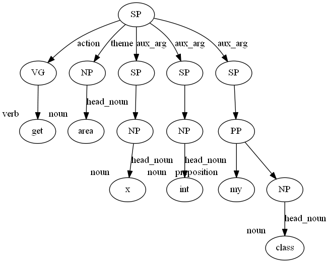

# SWUM Phrases Visualizer



The visualizer app constructs a [DOT](https://en.wikipedia.org/wiki/DOT_%28graph_description_language%29) graph representing the phrase tree for a single identifier (specified by ID) from the output of the SWUM phrases layer.

# Installation

1. Install Python dependencies.
```
pip install lxml
```


# Usage
```
python visualizer.py phrases_output swum_id
```

## Input
The program accepts a XML output file from the SWUM phrases layer and a SWUM ID correspoding to the identifier whose phrase tree should be visualized.

## Output
A DOT graph of a phrase tree for the specified identifier.
